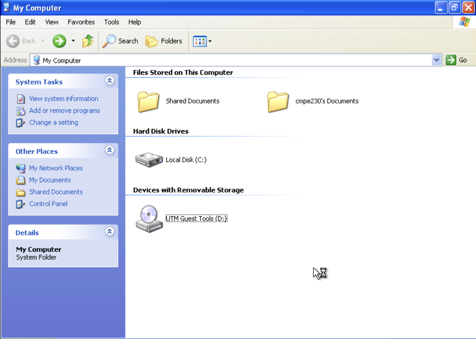
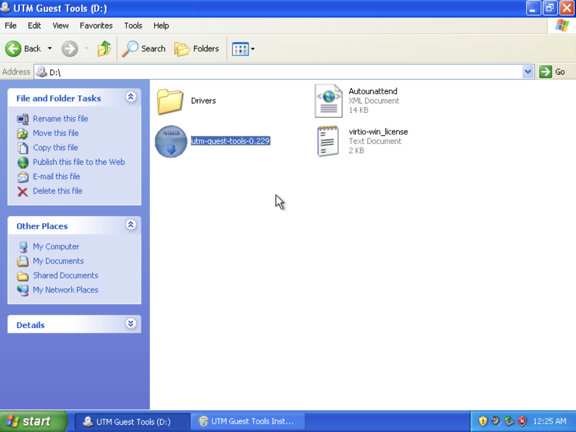
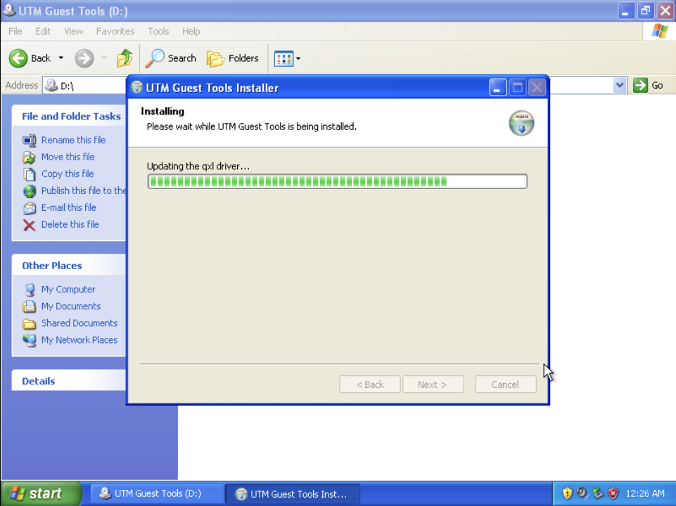

# Emulating Windows XP on macOS (ARM Chips) with UTM

Follow the official guide: [Windows XP on UTM](https://mac.getutm.app/gallery/windows-xp)

---

## **Requirements**

You need a Windows XP installation ISO. A commonly used working image for English users is:

- **Filename:** `en_windows_xp_professional_sp3_Nov_2013_Incl_SATA_Drivers.iso`
- **SHA1 Hash:** `6947e45f7eb50c873043af4713aa7cd43027efa7`
- **Download:** [Archive.org](https://archive.org/details/en_windows_xp_professional_sp3_nov_2013_incl_sata_drivers_202111)

---

## **Installation Steps**

1. Open the downloaded **Windows XP UTM template (`.utm`)**.
2. Select **Windows XP** in UTM.
3. At the bottom of the screen, locate **Interface: IDE**, then select an image.
4. Choose your **Windows XP installation ISO**.
5. Start the VM.
6. Install Windows XP with **all default options**.
7. After installation, download the **[SPICE tools ISO](https://docs.getutm.app/guest-support/windows/#download)**.
8. Use the **CD icon** in the toolbar to eject the Windows installation ISO and select the **SPICE tools ISO**.
9. Install the SPICE tools on Windows XP. Refer to the screenshots below for guidance:
   
   
   
   
   
   

10. **Copy-paste functionality should now work.**
11. Follow the steps in [this guide](http://aturing.umcs.maine.edu/~meadow/courses/cos335/assemblers.pdf) to set up **A86 assembler**.
12. A pre-configured UTM template with SPICE tools pre-installed is available on [**Zenodo**](https://zenodo.org/records/14969111).

---

## **Setting Up a Shared Directory**

1. **Stop the VM**.
2. Open **Edit > Sharing > Shared Directory**.
3. Select the folder you want to share.
4. Restart the VM.

### **Troubleshooting: Directory Sharing Not Working?**
If the shared folder is not visible inside Windows XP, try these alternative file-sharing methods.

---

## **Method 1: Use a Virtual USB Drive (Most Reliable)**

This method creates a **virtual USB drive** that can be accessed by both **macOS and Windows XP**.

### **Step 1: Create a Virtual USB Drive on macOS**

1. Open **Disk Utility** on macOS.
2. Click **File → New Image → Blank Image**.
3. Name the file (e.g., `SharedUSB.img`).
4. Set the **Size** to at least **1 GB**.
5. Set **Format** to **MS-DOS (FAT)** (compatible with Windows XP).
6. Set **Partition** to **Master Boot Record**.
7. Click **Save** to create the file.

### **Step 2: Attach the USB Image to UTM**

1. Open **UTM** and go to **VM Settings**.
2. Click **Drives → Add New Drive**.
3. Select **Import Existing Drive**.
4. Browse and select the `SharedUSB.img` file you created.
5. Set **Interface** to `USB`.
6. Click **Save**.

### **Step 3: Mount the USB Drive in Windows XP**

1. Start your **Windows XP VM** in UTM.
2. Open **My Computer**.
3. A new **USB drive (e.g., E:\)** should appear.
4. Copy files to this drive.

### **Step 4: Access Files in macOS**

1. Shut down the **Windows XP VM**.
2. Open **Disk Utility**.
3. Locate the `SharedUSB.img` file.
4. Click **Mount**.
5. Open **Finder** to access the USB drive.

---

## **Method 2: Use an ISO Image (Alternative)**

If **USB sharing does not work**, create an **ISO file** and mount it in Windows XP.

### **Step 1: Create an ISO Image on macOS**

1. Open **Terminal**.
2. Run the following command:
    ```sh
    hdiutil makehybrid -o SharedFiles.iso ~/Desktop/SharedFolder -iso -joliet
    ```
    - Replace `~/Desktop/SharedFolder` with the actual folder path.
    - This will create `SharedFiles.iso` on your desktop.

### **Step 2: Mount the ISO in UTM**

1. Open **UTM** and go to **VM Settings**.
2. Click **Drives → Add New Drive**.
3. Select **Import Existing Drive** and choose `SharedFiles.iso`.
4. Set **Interface** to `CD/DVD`.
5. Click **Save**.

### **Step 3: Access the Files in Windows XP**

1. Start your **Windows XP VM**.
2. Open **My Computer**.
3. The shared files should appear in the **CD drive**.
4. Copy files to your **Windows XP drive**.

---

### **Final Notes**

- **SPICE tools** enable **copy-paste, better graphics, and mouse integration**.
a- If **SPICE tools are not working**, try reinstalling them using the steps above.
- The **pre-configured UTM template on Zenodo** has these steps completed, so you can start using Windows XP immediately.

---

This guide should help you set up Windows XP on **macOS with UTM**, including **installation, SPICE tools, and file sharing**.

For additional troubleshooting, visit the **[UTM Documentation](https://docs.getutm.app/)**.


